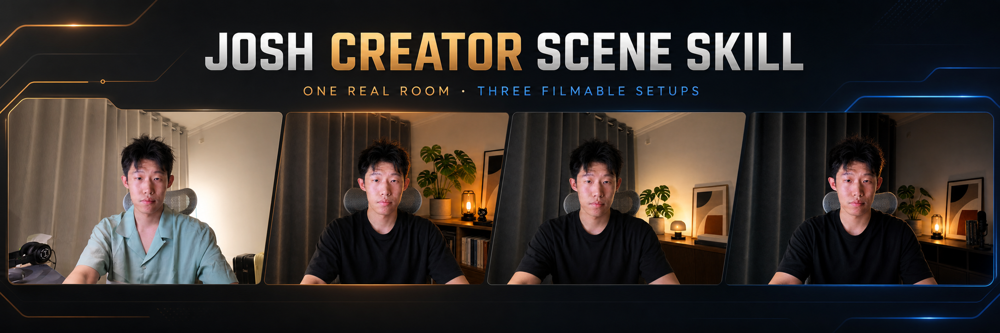
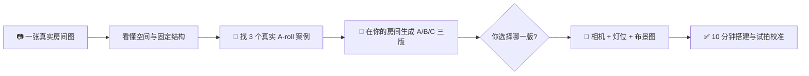

<p align="center">
  
</p>

<h1 align="center">🎬 Josh Creator Scene Skill</h1>

<p align="center"><b>拍一张你的房间，AI 帮你把它变成三套真正能拍的口播场景。</b><br>
<sub>找参考 · 看空间 · 出三版 · 选方向 · 给灯位 —— 你不需要懂布光，也不需要会写提示词。</sub></p>

<p align="center">
  
  
  
  
</p>

> 你还在为口播背景发愁吗？以前要刷几十个博主、猜灯放哪里、买一堆不一定有用的东西。现在只要上传一张房间照片，Agent 会先替你找适配案例，再在**你的真实空间**里生成三版效果，最后告诉你相机、灯和布景具体放在哪里。

---

## 先看结果：一张普通房间图，可以变成什么？

### 输入：你现在真实拍出来的样子

<p align="center">
  
</p>

### 输出：同一个房间，三种真正能拍的方向

| A · 温暖创作者工作室 | B · 极简产品设计师 | C · 深色专业科技感 |
|:---:|:---:|:---:|
|  |  |  |
| 暖灯、植物、书和创作者工具 | 更干净的留白与产品感 | 更深的对比与人物分离 |

这三张不是三个陌生房间。人物、机位、桌子方向、窗帘、墙面和真实纵深都来自同一张输入图。

你选中一版后，Skill 还会继续给出：

- 相机放在哪里、镜头多高、取什么景别；
- 主光、负补光、背景灯分别放在哪里；
- 哪些现有物品保留、移走或补充；
- 缺什么再买什么，而不是先列一张昂贵购物单；
- 一套 10 分钟就能照着摆的执行顺序。

---

## 你只需要做两个决定

| 你要做的 | Agent 替你做的 |
|---|---|
| **1. 上传一张真实场景图** | 分析机位、人物、桌面、前中后景和真实空间纵深 |
| **2. 从 A / B / C 里选一版** | 找三个真实 A-roll 案例、生成三版效果、写出最终布光布景方案 |

不用先学伦勃朗光，不用量一堆色温参数，也不用知道什么是 SDK、MCP 或 CLI。

## 它不是“把房间 P 漂亮”

普通生图很容易出现这些问题：

- 凭空多出显示器、桌子或一扇门；
- 把原本笔直的桌子画成斜桌；
- 把人物左边和画面左边搞反；
- 生成一张很美、现实却根本摆不出来的装修图；
- 你明确说不喜欢的东西，下一版又回来了。

Josh Creator Scene Skill 把这些真实踩坑写成了硬规则：

1. **真实房间是几何基准**：不随意改墙、窗、门、桌子和机位。
2. **永远使用双坐标**：例如 `画面右（人物左）`，避免把灯位说反。
3. **先看三版再选择**：不会只给一张“碰运气”的效果图。
4. **保留你的反馈**：喜欢、拒绝和纠正都会进入 approval ledger，后续版本必须继承。
5. **效果图之后还有交付**：视觉预览不是终点，能在房间里复刻才算完成。

---

## 安装

### Codex

```bash
git clone https://github.com/joshzhao-ai/Josh-creator-scene-skill.git \
  ~/.codex/skills/josh-creator-scene-skill
```

开启一个新任务，上传你的场景图，然后直接说：

```text
$josh-creator-scene-skill

这是我当前真实的拍摄空间，我主要做 AI / 科技口播内容。
请先分析空间，找三个真正适合我房间的 A-roll 案例，
然后在我的真实空间里生成 A / B / C 三版效果图让我选择。
不要改变房间结构，不要凭空增加显示器或家具。
我选定后，再给我具体的相机、打光和布景方案。
```

### Claude Code

```bash
git clone https://github.com/joshzhao-ai/Josh-creator-scene-skill.git \
  ~/.claude/skills/josh-creator-scene-skill
```

新会话上传房间图并说“帮我设计三版口播场景”即可触发。

> 需要支持：联网查找真实案例、多模态读图，以及图片编辑/生成能力。缺少某项能力时，Skill 会明确停在对应阶段，不会伪造案例或效果图。

---

## 工作原理



Skill 的核心不是某一句提示词，而是把完整经验封装起来：真实案例筛选、空间判断、审美方向、图像生成约束、左右坐标、用户反馈继承、结果验收和最终执行。

## 适合谁

- 想做 AI、科技、知识、课程或个人品牌口播的创作者；
- 房间不大，不想装修，只想把一个角落拍好；
- 看了很多博主，却不知道哪些风格适合自己的空间；
- 买过灯，但仍然不知道主光到底应该放哪边；
- 想在购买家具和设备前，先看到接近最终效果的预览。

<details>
<summary><b>高级用户：底层可编程引擎</b></summary>

仓库保留了一个可选 Python 引擎，用来做状态管理、三版约束、图片 Provider 和 CLI 自动化。普通用户不需要理解或安装它。

```bash
python -m venv .venv
source .venv/bin/activate
pip install -e '.[openai]'
josh-creator-scene --help
```

生图 Provider 默认适配 OpenAI `gpt-image-2`，也可以替换成其他支持参考图编辑的服务。

</details>

## 已知边界

- 效果图是视觉预演，不等于精确家具尺寸证明；涉及购买前仍建议补充房间尺寸。
- 只给正面单张照片时，遮挡区域的判断会标记为不确定；10 秒空间扫拍可以提高可靠性。
- 不保证一次生图就完美；输出若改变身份或房间结构，Skill 应自动做一次针对性修正。
- 它解决的是“怎样把现有空间拍好”，不是完整室内装修设计。

## 反馈

请开一个 Issue，附上：原始场景图、最接近的一版，以及一句“哪里还不对”。真正能提升泛化和稳定性的反馈会继续写回 Skill。

---

<p align="center"><sub>v0.2 · 2026-07 · 从 Josh 的真实 AI 科技口播房间里长出来 · Made by Josh × Codex</sub></p>
