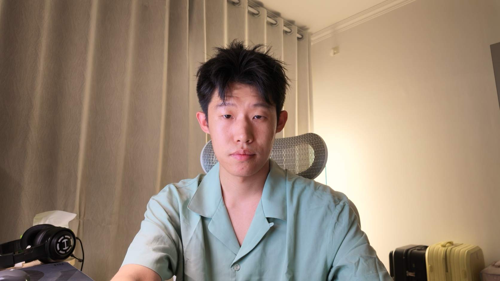
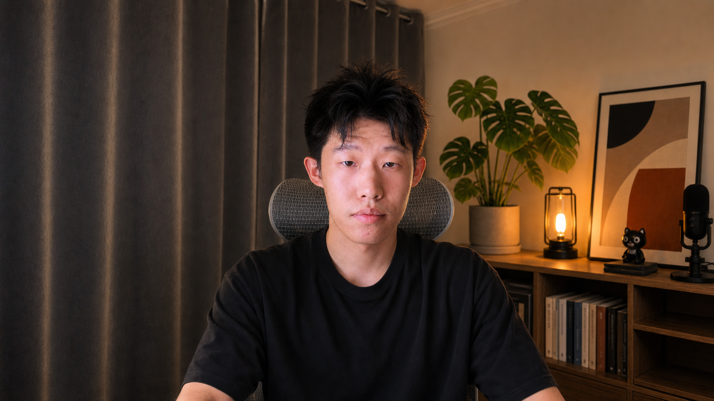
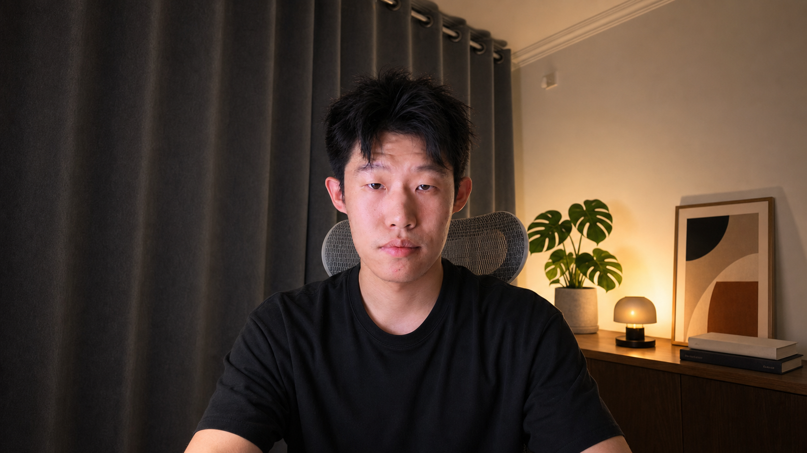
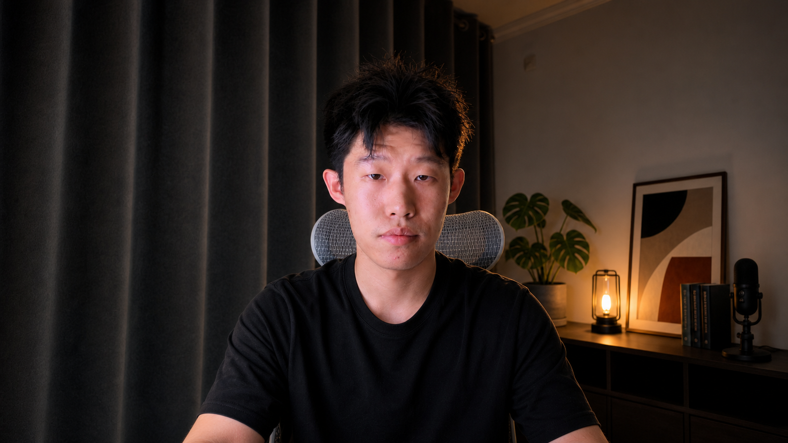
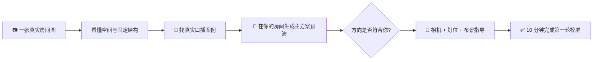

<h1 align="center">🎬 Josh Creator Scene Skill</h1>

<p align="center"><b>上传一张真实房间图，直接看主方案效果，再拿到相机、灯位和布景指导。</b><br>
<sub>你不需要懂布光，也不需要会写提示词。</sub></p>

| 输入前 · 普通房间 | 输入后 · 主方案效果预演 |
|:---:|:---:|
|  |  |
| 真实空间、固定机位、没有专门装修 | 同一个空间，加入可移动布景并重新设计光线 |

<p align="center"><b>1 张房间图 → 1 套主方案 + 效果预演 + 执行指导</b></p>

<p align="center">
  
  
  
  
</p>

> 这不是换房装修。Skill 会先读懂你的真实空间，再把适配的口播构图和打光方式放进这个房间，最后告诉你相机、灯和布景具体放在哪里。

---

## 你最终会拿到什么？

- 一套基于真实房间生成的主方案效果预演；
- 相机位置、取景范围和人物坐姿；
- 主光方向、背景亮度和第一轮校准顺序；
- 现有物品的保留、移走与补充建议；
- 如果方向还不确定，再补充少量备选方案供比较。

> 效果图是 AI 视觉预演，用来提前判断方向，不是已经完成的实体改造图。

方向确认后，Skill 会继续给出：

- 相机放在哪里、镜头多高、取什么景别；
- 主光、负补光、背景灯分别放在哪里；
- 哪些现有物品保留、移走或补充；
- 缺什么再买什么，而不是先列一张昂贵购物单；
- 一套用来完成第一轮灯光校准的 10 分钟执行顺序。

<details>
<summary><b>需要比较时，还可以查看两个备选方向</b></summary>

| 极简产品设计师 | 深色专业科技感 |
|:---:|:---:|
|  |  |

</details>

---

## 你只需要做两个决定

| 你要做的 | Agent 替你做的 |
|---|---|
| **1. 上传一张真实场景图** | 分析机位、人物、桌面、前中后景和真实空间纵深 |
| **2. 确认主方案是否符合你** | 找真实口播案例、生成效果预演、写出最终布光布景方案 |

不用先学伦勃朗光，不用量一堆色温参数，也不用知道什么是 SDK、MCP 或 CLI。

## 它不是“把房间 P 漂亮”

普通生图很容易出现这些问题：

- 凭空多出显示器、桌子或一扇门；
- 把原本笔直的桌子画成斜桌；
- 把人物左边和画面左边搞反；
- 生成一张很美、现实却根本摆不出来的装修图；
- 你明确说不喜欢的东西，下一版又回来了。

Josh Creator Scene Skill 把这些真实踩坑写成了硬规则：

1. **真实房间是几何基准**：不随意改墙、窗、门、桌子和机位。
2. **永远使用双坐标**：例如 `画面右（人物左）`，避免把灯位说反。
3. **先给主方案，再按需比较**：主结果足够清楚，需要时再补充备选方向。
4. **保留你的反馈**：喜欢、拒绝和纠正都会进入偏好清单，后续版本必须继承。
5. **效果图之后还有交付**：视觉预演不是终点，还要继续给出执行指导。

---

## 安装

### Codex

```bash
git clone --branch v0.2.2 --depth 1 \
  https://github.com/joshzhao-ai/Josh-creator-scene-skill.git \
  ~/.codex/skills/josh-creator-scene-skill
```

开启一个新任务，上传你的场景图，然后直接说：

```text
$josh-creator-scene-skill

这是我当前真实的拍摄空间，我主要做 AI / 科技口播内容。
请先分析空间，找真正适合我房间的口播案例，
然后在我的真实空间里生成一套主方案效果预演。
不要改变房间结构，不要凭空增加显示器或家具。
方向确认后，再给我具体的相机、打光和布景方案。
```

### Claude Code / 其他 Agent

```bash
git clone --branch v0.2.2 --depth 1 \
  https://github.com/joshzhao-ai/Josh-creator-scene-skill.git \
  ~/.claude/skills/josh-creator-scene-skill
```

在具备联网搜索、多模态读图和参考图编辑能力的环境中，新会话上传房间图并说“帮我设计口播场景并给出效果预演”即可触发。

| 能力 | 用途 | 缺少时 |
|---|---|---|
| 多模态读图 | 分析真实空间 | 无法启动空间判断 |
| 联网搜索 | 核验真实口播案例 | 停在空间分析，不伪造来源 |
| 参考图编辑/生图 | 生成主方案预演 | 只交付文字方向和提示词 |

> 图片会发送给你当前配置的生图服务；请先隐藏不希望上传的私人信息。生成成本取决于你使用的模型与 Provider。

<details>
<summary><b>更新与卸载</b></summary>

```bash
# 更新到最新版本
git -C ~/.codex/skills/josh-creator-scene-skill fetch --tags
git -C ~/.codex/skills/josh-creator-scene-skill checkout v0.2.2

# 卸载
rm -rf ~/.codex/skills/josh-creator-scene-skill
```

</details>

---

## 工作原理



Skill 的核心不是某一句提示词，而是把完整经验封装起来：真实案例筛选、空间判断、审美方向、图像生成约束、左右坐标、用户反馈继承、结果验收和最终执行。

## 适合谁

- 想做 AI、科技、知识、课程或个人品牌口播的创作者；
- 房间不大，不想装修，只想把一个角落拍好；
- 看了很多博主，却不知道哪些风格适合自己的空间；
- 买过灯，但仍然不知道主光到底应该放哪边；
- 想在购买家具和设备前，先看到接近最终效果的预览。

<details>
<summary><b>高级用户：底层可编程引擎</b></summary>

仓库保留了一个可选 Python 引擎，用来做状态管理、方案约束、图片 Provider 和 CLI 自动化。普通用户不需要理解或安装它。

```bash
python -m venv .venv
source .venv/bin/activate
pip install -e '.[openai]'
josh-creator-scene --help
```

生图 Provider 默认适配 OpenAI `gpt-image-2`，也可以替换成其他支持参考图编辑的服务。

</details>

## 已知边界

- 效果图是视觉预演，不等于精确家具尺寸证明；涉及购买前仍建议补充房间尺寸。
- 只给正面单张照片时，遮挡区域的判断会标记为不确定；10 秒空间扫拍可以提高可靠性。
- 不保证一次生图就完美；输出若改变身份或房间结构，Skill 应自动做一次针对性修正。
- 它解决的是“怎样把现有空间拍好”，不是完整室内装修设计。

## 反馈

请开一个 Issue，附上：原始场景图、最接近的一版，以及一句“哪里还不对”。真正能提升泛化和稳定性的反馈会继续写回 Skill。

---

> 代码与 Skill 工作流采用 MIT License。`examples/` 与 `assets/` 中包含 Josh 人像的演示素材仅用于项目说明，不授予独立转载、训练或商业复用许可。

<p align="center"><sub>v0.2.2 Public Beta · 2026-07 · 从 Josh 的真实 AI 科技口播房间里长出来 · Made by Josh × Codex</sub></p>
